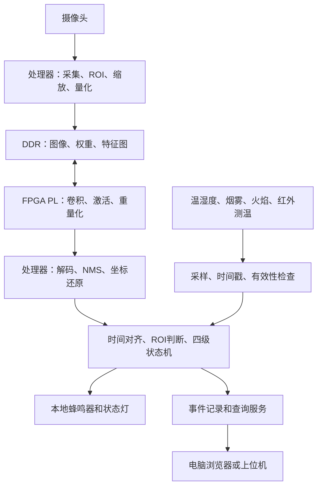

# 校园火险多源感知预警系统实现架构

版本：v0.1，2026-09-26。依据：工作区任务书、开题报告，以及用户确认的 1000 元硬件预算。本文描述拟实现方案，所有速度、资源和精度目标均须通过实验确认。

## 1 项目范围和完成标准

主场景为一个固定摄像机监测一个配电设施周边区域。初始类别固定为 smoke、fire、leaf_pile 三类。配电设施的位置由人工配置的 ROI 多边形标明，第一版无需增加配电箱检测类别。

任务书要求核心算子硬件加速；开题报告也提出检测器在 FPGA 上运行。因此分两级交付：基础阶段完成真实检测链路中的卷积 PL 加速，其余计算在处理器执行；完整目标让约定的卷积网络计算全部由 PL 执行，处理器保留预处理、检测框解码、NMS 和风险融合。论文必须分别报告实际部署范围。只完成单算子演示不能称为完整网络上板。

三类是主方案，开题报告中的单类或双类表述作为资源不足时的退守项。若最终改变类别数或用 ROI 分类替代目标检测，需要同步说明论文目标的变化。

现有电脑可承担训练、仿真、数据标注和展示，暂不计入硬件预算；其配置及学校可借用的训练资源仍待确认。不购买训练显卡、工业相机、独立显示器或设计定制 PCB。

## 2 总体数据流



主方案是带 ARM 处理器与 DDR 的 Zynq PS+PL。优先比较资料齐全的二手 Zynq-7010/7020 完整板，型号须结合含配件总价、接口和综合报告确定。芯片有 USB 控制器不代表板上具备可用 USB Host 接口，必须核对 PHY、供电和软件支持。

摄像头接入优先级：已有可用驱动的板载接口或 USB Host；若廉价板不具备条件，开发阶段由电脑摄像头经以太网发送图像。后一方案明确标为电脑辅助原型，不能宣称独立边缘采集。普通串口只用于传感数据和调试，不承担实时图像传输。

## 3 软件和硬件职责

| 部分 | 拟承担功能 | 验证产物 |
|---|---|---|
| 训练电脑 | 标注、训练、量化、导出、软件参考模型 | 数据版本、权重、精度与逐层结果 |
| PS 处理器 | 图像采集、预处理、DMA 调度、解码和 NMS | 单帧日志、各阶段耗时 |
| FPGA PL | 3×3/1×1 卷积、步长 1/2、ReLU、重量化；按模型需要添加池化 | RTL、测试台、综合与时序报告 |
| 传感接口 | 数字传感器走 I²C/GPIO；模拟传感器走外置 ADC | 标定记录、原始值、有效性字段 |
| 风险服务 | 时间对齐、阈值判断、状态转换、报警和事件存储 | 可回放的触发原因与状态轨迹 |
| 展示端 | 当前画面、检测框、传感读数、风险级别、一键刷新和历史事件 | 单页界面和联调记录 |

软件基线优先使用 Python；板端推理调度可采用 C/C++，具体系统镜像及驱动在选板后锁定。融合规则用可移植的数据结构实现，支持电脑回放与板端运行。网页仅做简单状态展示，不引入账户系统和云平台。

## 4 轻量化模型路线

先建立成熟轻量 YOLO 的软件对照基线，再训练硬件友好的学生模型。学生模型具体基于哪个 YOLO 实现、版本和配置，要在环境与算子清单验证后冻结，不能认为替换激活或卷积后仍可原样使用预训练权重。

拟比较 128×128 和 96×96 两种输入，以 128 为首个候选。预处理使用固定 ROI 裁剪与等比例缩放加填充，训练、验证、整数参考和板端共用相同规则；保存原图到网络输入的变换参数，用于检测框还原。

首版学生网络采用普通 3×3/1×1 卷积、ReLU、小通道数和简单检测头，优先探索步长 8/16 的检测尺度。避免一开始引入注意力、复杂激活和多种定制算子。可以用 YOLO 式简化检测头，但若重新设计头部，必须实现匹配的训练损失、标签分配和解码，并明确属于定制模型。

深度可分离卷积作为消融实验项：只有精度、资源和板上延迟均有收益时才纳入硬件。首轮探索规模约 0.2–1M 参数、10–30M MAC/帧，属于搜索预算而非已得到的模型性能；实际按逐层形状计算。小输入对远距离烟雾、小火苗不利，须按目标像素尺寸分别报告召回率。

数据按地点、采集视频和日期分组划分训练/验证/测试集，避免同一视频相邻帧泄漏。校园数据应包括落叶、反光、夕阳、雾气、灯光等困难负样本。不能把 COCO 检测指标当作本项目火险检测精度。

## 5 定点规格与 FPGA 数据通路

第一版拟采用 W8A8、对称量化、零点为 0、int32 累加。权重按输出通道设尺度，激活按层设尺度。若精度不够，比较 QAT 和 W8A16；W8A16 是独立配置，重新核算带宽、DSP 和累加位宽。

先用 PTQ 做可行性与误差诊断，再用 QAT 恢复精度。借鉴参考项目的验证方法，不继承其“禁止 PTQ”的项目约束。

整数合同至少固定：RGB 顺序、输入归一化、张量布局、padding、stride、BN 折叠顺序、偏置量化、乘法器与移位参数、负数舍入、饱和和激活顺序。建议主存布局 NHWC，权重 OIHW，尾通道补零；导出器记录逻辑尺寸与填充尺寸。任何调整都更新格式版本。

量化卷积定义：acc = Σ(qx × qw) + qb；qb 的尺度为 sx × sw[o]；输出利用整数乘子和移位近似 sx × sw[o] / sy。乘法中间结果用足够宽度，右移采用明确定义的最近舍入，最终饱和到输出位宽。Python 参考与 RTL 必须逐位执行同一规则。对每层使用 K²×Cin×max|qx|×max|qw|+|qb| 校核累加上界，不能仅因采用 int8 就默认 int32 安全。

```text
AXI DMA 输入 → tile 缓存/行缓存 → 窗口生成 → 小型 MAC 阵列
                                         ↓
AXI DMA 输出 ← 输出 FIFO ← ReLU/饱和 ← 重量化/偏置
                    AXI-Lite 配置与状态寄存器
```

采用可复用的逐层计算引擎，权重和大特征图在 DDR，BRAM 保存当前 tile、窗口和局部和。第一版从 4 输入通道×4 输出通道的乘加并行度探索，再根据综合结果扩展；参数化并行度必须有对应测试，不能默认任意尺寸成立。

先完成单缓冲正确性，再加入乒乓缓存和计算/传输重叠。多个时钟域用合规 CDC/FIFO；流接口支持 valid/ready 和反压。DMA 调度明确缓存刷新/失效、缓冲区所有权、长度检查、超时复位与错误回传。

配置合同包含 op、输入/输出尺寸、通道、stride、padding、量化参数及 start；状态包含 busy、done、error、cycle_count。物理寄存器地址和 DMA 位宽在板卡确定后冻结。每个模型包包含 model_id、格式版本、算子描述、权重、量化表、校验值与 golden vectors，加载时检查与硬件能力一致。

性能估算同时计算计算周期、DDR 流量和处理器耗时。理论 MAC 数/并行度/频率只是下界，报告必须纳入通道填充、流水等待、传输和后处理。展示 FPS、推理 FPS、报警延迟分别测量。

## 6 多源感知和分级风险

传感器候选包含温湿度、烟雾模拟量、火焰模块和非接触红外测温。红外测温与简单红外火焰模块不能混为同一种测量。低价烟雾模块先作为相对变化量使用，未标定不能输出精确浓度；普通火焰模块不能直接证明火源类型。

落叶框与配电设施 ROI 相交且持续存在，构成风险积累证据。框面积占比仅作为图像中的堆积代理指标，不能表述为真实堆积体积、干燥程度或物理距离。湿度只能提供环境背景。

| 风险状态 | 第一版规则方向，数值由验证集与受控实验标定 |
|---|---|
| 正常 | 数据新鲜且有效，未满足其他风险规则 |
| 关注 | ROI 内持续出现落叶堆积，或单一弱异常持续存在 |
| 预警 | 持续烟雾、温升等较强单源证据，或落叶与温升等组合证据 |
| 报警 | 经标定的强火情证据，或时间与空间对应的多源火情证据；强单源报警不强制等待其他传感器 |

升级、降级采用不同阈值与持续时间，避免状态抖动；降级设置更长恢复窗口，报警确认单独记录。失联、过期、传感器预热和相机停帧输出独立 health 状态，不能把缺失数据当作 0 并显示正常。缺少模态时执行剩余模态规则，并显示数据不完整。

图像、检测结果、传感采样均带 node_id、frame_id/sequence、时间戳和 valid。统一使用节点单调时钟作融合时间，保存墙钟时间供事件查询。融合窗口与最大数据年龄须匹配采样率、推理耗时和传感器响应时间；禁止拿未来采样补充过去帧造成回放偏差。

事件字段至少包括 event_id、风险级别、触发/解除时间、reason_codes、传感读数及年龄、检测摘要、模型版本、规则版本、设备健康状态。先用追加 JSONL 或 SQLite 保存，实现回放后再开发简单查询接口。

按照开题报告，电气异常只采用非接触测量、低压模拟或外部输入。本原型不通过图像宣称测得漏电，也不把模拟注入当作真实传感验证。

## 7 验证与论文证据

1. FP32 与量化模型比较各类别 Precision、Recall、mAP 和不同目标尺寸表现；不能要求浮点与整数逐位一致。
2. Python/C 整数参考与 RTL 比较每层整数输出，要求所支持算子 bit-exact；覆盖负数、饱和、padding、尾通道、随机反压、连续任务及复位。
3. 上板将真实数据经过 PL 计算并读回比较，保留综合资源、实现时序、周期计数和输出摘要；仿真不能替代上板证据。
4. 软件基线、量化软件、PS+PL 三组使用同一输入，分别测纯计算和包含传输的端到端延迟，披露哪些层仍在 PS。
5. 视觉单模态、传感单模态、多源融合使用相同事件回放做对照。报告事件级漏报率、每小时误报次数、响应延迟分布，写明真值、匹配窗口和事件去重规则。
6. 测试传感器失联、摄像头停帧、网络中断、推理超时和模型包不匹配。展示断网时的本地报警与恢复行为。

首轮可暂设端到端 2–5 FPS、量化 mAP@0.5 下降不超过 3 个百分点为探索目标，均非任务书承诺或已验证结果。报警延迟拆分为物理传感响应、采样、推理、融合持续时间与输出延迟，不能用推理 FPS 替代报警响应指标。

## 8 TridentVision 的借鉴边界

参考其模型到整数参考、RTL 对拍、板级测试的验证闭环，以及计算和存储分离、行缓存与 MAC 阵列的模块划分。其主工程包含 MicroBlaze C 固件，不能根据仓库简介描述成完全没有软件参与。[仓库说明](https://github.com/fromgof/TridentVision) [实际固件](https://github.com/fromgof/TridentVision/blob/main/fpga/stage3_hdmi/fw/src/main.c)

训练文档采用 W8A16，说明“int8 模型”不等于所有激活均为 int8；本项目 W8A8 是新设计选择。[训练导出说明](https://github.com/fromgof/TridentVision/blob/main/docs/training_export_guide.md)

其 MAC 源码包含 16×16 并行乘加和 48 位累加，内部部分归约仍按固定分组组织。我们拟自主实现更小阵列，不能仅改参数就假定现有代码适配。[MAC 源码](https://github.com/fromgof/TridentVision/blob/main/rtl/mac_array.v)

GigE 工业相机、HDMI 显示、自定义 K325T 板和完整大网络均不纳入首版范围。原项目性能不作为本项目性能预测。直接复用前记录许可证、来源文件、固定提交与改动；本次未复制源码，未锁定参考提交。网页读取只覆盖部分关键文档和源码，不构成全仓审计。

## 9 后续工程目录

以下为约定的目录职责，随实施建立；当前不填充空实现。

```text
configs/             模型、硬件能力、传感器、ROI、融合规则
datasets/            数据说明、划分清单与标注规则
training/            训练、量化、评估与导出
reference/           Python/C 整数参考和逐层输出
hardware/rtl/        卷积引擎、缓存、MAC、重量化与接口
hardware/tb/         算子与系统仿真
hardware/boards/     所选板卡约束、Tcl 和适配信息
runtime/             板端调度、采样、后处理、融合和报警
ui/                  单页状态查询
tests/               对拍与场景回放
experiments/         配置、日志、资源、时序和指标
docs/                架构、采购、实验协议和论文素材
```
